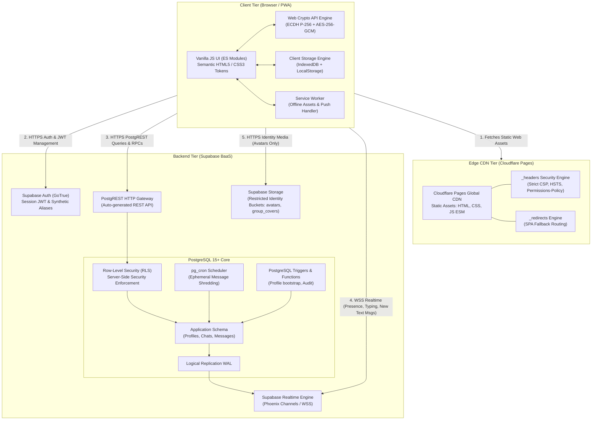
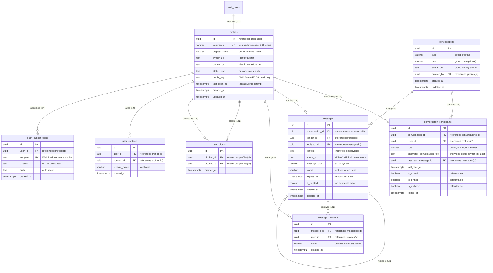
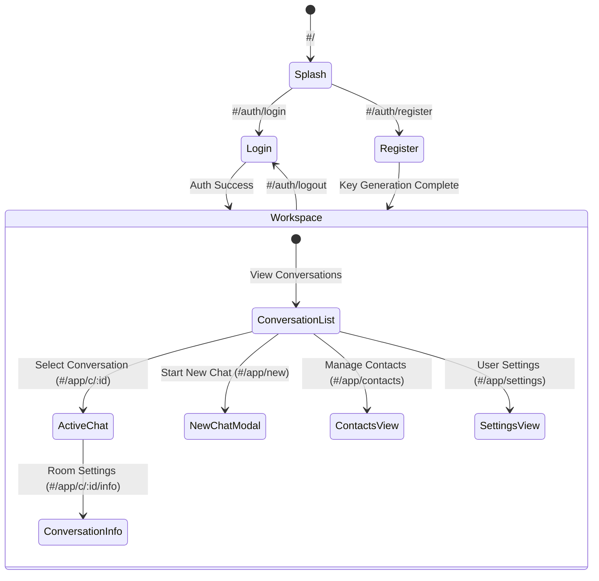

# ImdConnect — Comprehensive System Architecture & Engineering Blueprint

**Project Name:** ImdConnect  
**Architecture Version:** 1.1.0-PROD  
**Author:** Lead Software Architect  
**Target Platform:** Cloudflare Pages (Frontend CDN) + Supabase (PostgreSQL 15+, Auth, Realtime, Storage, pg_cron)  
**Core Technologies:** HTML5, CSS3, Vanilla JavaScript (ES Modules), Web Crypto API, PostgreSQL, Supabase Realtime  
**Permanent Policy Reference:** [AGENTS.md](file:///c:/xampp/htdocs/ImdConnect/AGENTS.md)

---

## Executive Summary

ImdConnect is a high-performance, privacy-focused, username-based **text-only messaging platform**. The core chat experience focuses exclusively on fast, secure, encrypted text communication. 

In strict adherence to the project charter:
- **Chat is strictly text-only:** Never add image, video, audio, document, file, or voice-message attachments to chats.
- **Identity Media Only:** Profile pictures, cover/banner images, and group profile pictures are allowed **only** as profile and group identity media.
- **Zero-BaaS Overhead:** Built without Node.js backend servers, without PHP, without MySQL, and without bloated client-side JavaScript frameworks.
- **Zero-PII Exposure:** No phone numbers, no public emails, and zero third-party telemetry.

The platform is statically hosted on Cloudflare Pages and backed exclusively by Supabase with Row-Level Security (RLS) guaranteeing a zero-trust architecture.

---

## 1. Complete Project Requirements Analysis

### 1.1 Core Principles & Text-Only Scope
1. **Strictly Text-Only Messaging:** ImdConnect provides ultra-clean, distraction-free, low-latency text messaging. File, voice, and video transfers within chat threads are prohibited by architectural mandate.
2. **Restricted Identity Media:** Avatars, user cover images, and group profile icons are supported solely for user/group visual identification.
3. **Zero Phone Numbers & Zero Public Emails:** Authentication and contact identification occur purely via unique alphanumeric usernames (e.g., `@alex_m`, `@cipher_99`).
4. **End-to-End Encryption (E2EE) Readiness:** Direct messages are encrypted at the client boundary using the Web Crypto API (ECDH P-256 + AES-256-GCM) prior to database persistence.
5. **Ephemeral Messaging (Self-Destructing Messages):** Messages support automated lifespans (30s, 5m, 1h, 24h, 7d). Expired messages are deleted server-side via PostgreSQL `pg_cron` and hidden immediately by client-side render filters.
6. **Mobile-First & Fully Responsive:** Designed mobile-first for small touchscreens (320px+) through desktop displays with touch targets $\ge$ 44x44px.
7. **Comprehensive Theme Support:** Native support for Light, Dark, and System (auto `prefers-color-scheme`) themes via CSS Custom Properties.

### 1.2 Functional Requirements Matrix

| ID | Feature | Specification |
|:---|:---|:---|
| **FR-01** | **Username Registration & Auth** | Registration via unique `@username` and high-entropy passphrase. Supabase Auth manages sessions via a deterministic synthetic alias (`<username>@auth.imdconnect.local`). |
| **FR-02** | **Cryptographic Key Generation** | Browser generates an ECDH (P-256) key pair via Web Crypto API. Public key is published to `profiles.public_key`; private key is stored in non-extractable client `IndexedDB`. |
| **FR-03** | **Contact Discovery** | Exact or prefixed username search via rate-limited PostgreSQL RPC. Global user scraping is strictly prohibited. |
| **FR-04** | **1-on-1 Direct Text Messaging** | Realtime bidirectional text messaging encrypted using pairwise AES-256-GCM keys derived via ECDH key agreement. |
| **FR-05** | **Group Text Conversations** | Multi-user text chat channels. Symmetric group key distributed to group members via pairwise ECDH encryption. |
| **FR-06** | **Realtime Status & Telemetry** | Ephemeral typing indicators and online/offline presence broadcast via Supabase Realtime (zero database writes). |
| **FR-07** | **Message Delivery Receipts** | Status tracking: `sent` (persisted), `delivered` (received by client), and `read` (viewed in viewport). |
| **FR-08** | **Ephemeral Shredding** | Configurable expiration timer (`expires_at`). Database auto-scrubs expired records every 60 seconds via `pg_cron`. |
| **FR-09** | **Identity Media Management** | Profile avatar and cover image upload to restricted Supabase Storage buckets (`avatars`, `group_covers`) with strict MIME and size limits (max 2MB). |
| **FR-10** | **Privacy & Blocking Controls** | User blocking, conversation muting, chat history purge, and complete account deletion with cascade wipe. |

### 1.3 Mandatory UI State Matrix (Rule 19)
Every view and data-bound component must implement all four fundamental UI states:
1. **Loading State:** Skeleton loaders and discreet activity indicators.
2. **Empty State:** Friendly guidance explaining that no conversations/contacts exist, with clear call-to-action buttons.
3. **Error State:** Clear error explanations with retry mechanisms (e.g., network failure, rate limit).
4. **Success / Content State:** The fully populated, interactive view.

---

## 2. Detailed Architecture Plan

### 2.1 System Topography



---

## 3. Database Entity Relationship Plan

### 3.1 Entity Relationship Diagram



### 3.2 SQL Table Definitions & Constraints

```sql
-- Extensions Required
CREATE EXTENSION IF NOT EXISTS "uuid-ossp";
CREATE EXTENSION IF NOT EXISTS "pgcrypto";
CREATE EXTENSION IF NOT EXISTS "pg_cron";

-- 1. Profiles Table (1:1 with auth.users)
CREATE TABLE public.profiles (
    id UUID PRIMARY KEY REFERENCES auth.users(id) ON DELETE CASCADE,
    username VARCHAR(30) NOT NULL,
    display_name VARCHAR(50),
    avatar_url TEXT,
    banner_url TEXT,
    status_text VARCHAR(120),
    public_key TEXT NOT NULL,
    last_seen_at TIMESTAMPTZ DEFAULT NOW(),
    created_at TIMESTAMPTZ DEFAULT NOW() NOT NULL,
    updated_at TIMESTAMPTZ DEFAULT NOW() NOT NULL,
    CONSTRAINT username_format_chk CHECK (username ~ '^[a-z0-9_]{3,30}$'),
    CONSTRAINT username_unique_idx UNIQUE (username)
);

-- 2. Conversations Table
CREATE TABLE public.conversations (
    id UUID PRIMARY KEY DEFAULT gen_random_uuid(),
    type VARCHAR(10) NOT NULL DEFAULT 'direct' CHECK (type IN ('direct', 'group')),
    title VARCHAR(100),
    avatar_url TEXT,
    created_by UUID REFERENCES public.profiles(id) ON DELETE SET NULL,
    created_at TIMESTAMPTZ DEFAULT NOW() NOT NULL,
    updated_at TIMESTAMPTZ DEFAULT NOW() NOT NULL
);

-- 3. Conversation Participants Table
CREATE TABLE public.conversation_participants (
    id UUID PRIMARY KEY DEFAULT gen_random_uuid(),
    conversation_id UUID NOT NULL REFERENCES public.conversations(id) ON DELETE CASCADE,
    user_id UUID NOT NULL REFERENCES public.profiles(id) ON DELETE CASCADE,
    role VARCHAR(10) NOT NULL DEFAULT 'member' CHECK (role IN ('owner', 'admin', 'member')),
    encrypted_conversation_key TEXT,
    last_read_message_id UUID,
    last_read_at TIMESTAMPTZ,
    is_muted BOOLEAN NOT NULL DEFAULT FALSE,
    is_pinned BOOLEAN NOT NULL DEFAULT FALSE,
    is_archived BOOLEAN NOT NULL DEFAULT FALSE,
    joined_at TIMESTAMPTZ DEFAULT NOW() NOT NULL,
    CONSTRAINT participant_unique_chk UNIQUE (conversation_id, user_id)
);

-- 4. Messages Table (Strictly Text-Only)
CREATE TABLE public.messages (
    id UUID PRIMARY KEY DEFAULT gen_random_uuid(),
    conversation_id UUID NOT NULL REFERENCES public.conversations(id) ON DELETE CASCADE,
    sender_id UUID NOT NULL REFERENCES public.profiles(id) ON DELETE CASCADE,
    reply_to_id UUID REFERENCES public.messages(id) ON DELETE SET NULL,
    content TEXT NOT NULL,
    nonce_iv TEXT NOT NULL,
    message_type VARCHAR(10) NOT NULL DEFAULT 'text' CHECK (message_type IN ('text', 'system')),
    status VARCHAR(12) NOT NULL DEFAULT 'sent' CHECK (status IN ('sent', 'delivered', 'read')),
    expires_at TIMESTAMPTZ,
    is_deleted BOOLEAN NOT NULL DEFAULT FALSE,
    created_at TIMESTAMPTZ DEFAULT NOW() NOT NULL,
    updated_at TIMESTAMPTZ DEFAULT NOW() NOT NULL
);

-- 5. Message Reactions Table
CREATE TABLE public.message_reactions (
    id UUID PRIMARY KEY DEFAULT gen_random_uuid(),
    message_id UUID NOT NULL REFERENCES public.messages(id) ON DELETE CASCADE,
    user_id UUID NOT NULL REFERENCES public.profiles(id) ON DELETE CASCADE,
    emoji VARCHAR(10) NOT NULL,
    created_at TIMESTAMPTZ DEFAULT NOW() NOT NULL,
    CONSTRAINT user_message_emoji_chk UNIQUE (message_id, user_id, emoji)
);

-- 6. User Blocks Table
CREATE TABLE public.user_blocks (
    id UUID PRIMARY KEY DEFAULT gen_random_uuid(),
    blocker_id UUID NOT NULL REFERENCES public.profiles(id) ON DELETE CASCADE,
    blocked_id UUID NOT NULL REFERENCES public.profiles(id) ON DELETE CASCADE,
    created_at TIMESTAMPTZ DEFAULT NOW() NOT NULL,
    CONSTRAINT block_unique_chk UNIQUE (blocker_id, blocked_id),
    CONSTRAINT self_block_prevent_chk CHECK (blocker_id <> blocked_id)
);

-- 7. User Contacts Table
CREATE TABLE public.user_contacts (
    id UUID PRIMARY KEY DEFAULT gen_random_uuid(),
    user_id UUID NOT NULL REFERENCES public.profiles(id) ON DELETE CASCADE,
    contact_id UUID NOT NULL REFERENCES public.profiles(id) ON DELETE CASCADE,
    custom_name VARCHAR(50),
    created_at TIMESTAMPTZ DEFAULT NOW() NOT NULL,
    CONSTRAINT contact_unique_chk UNIQUE (user_id, contact_id)
);

-- 8. Push Subscriptions Table
CREATE TABLE public.push_subscriptions (
    id UUID PRIMARY KEY DEFAULT gen_random_uuid(),
    user_id UUID NOT NULL REFERENCES public.profiles(id) ON DELETE CASCADE,
    endpoint TEXT NOT NULL UNIQUE,
    p256dh TEXT NOT NULL,
    auth TEXT NOT NULL,
    created_at TIMESTAMPTZ DEFAULT NOW() NOT NULL
);
```

### 3.3 High-Performance Database Indexes

```sql
-- Conversation indexing
CREATE INDEX idx_conversations_updated_at ON public.conversations(updated_at DESC);
CREATE INDEX idx_participants_user_conv ON public.conversation_participants(user_id, conversation_id);
CREATE INDEX idx_participants_conversation ON public.conversation_participants(conversation_id);

-- Message queries with pagination
CREATE INDEX idx_messages_conversation_created ON public.messages(conversation_id, created_at DESC);
CREATE INDEX idx_messages_sender ON public.messages(sender_id);

-- Ephemeral sweep index
CREATE INDEX idx_messages_expires_at ON public.messages(expires_at) WHERE expires_at IS NOT NULL;

-- Exact username discovery index
CREATE INDEX idx_profiles_username ON public.profiles(username);
```

### 3.4 Automated Ephemeral Shredding (pg_cron)

```sql
SELECT cron.schedule(
    'shred-expired-text-messages',
    '* * * * *',
    $$
    DELETE FROM public.messages
    WHERE expires_at IS NOT NULL 
      AND expires_at <= NOW();
    $$
);
```

---

## 4. Security Plan & Server-Side Enforcement (Rule 13)

### 4.1 Server-Side Row-Level Security (RLS)
Client-side JavaScript checks are purely for UX; the database enforces all security boundaries.

```sql
ALTER TABLE public.profiles ENABLE ROW LEVEL SECURITY;
ALTER TABLE public.conversations ENABLE ROW LEVEL SECURITY;
ALTER TABLE public.conversation_participants ENABLE ROW LEVEL SECURITY;
ALTER TABLE public.messages ENABLE ROW LEVEL SECURITY;
ALTER TABLE public.message_reactions ENABLE ROW LEVEL SECURITY;
ALTER TABLE public.user_blocks ENABLE ROW LEVEL SECURITY;
ALTER TABLE public.user_contacts ENABLE ROW LEVEL SECURITY;
ALTER TABLE public.push_subscriptions ENABLE ROW LEVEL SECURITY;

CREATE OR REPLACE FUNCTION public.is_conversation_participant(target_conv_id UUID)
RETURNS BOOLEAN LANGUAGE sql SECURITY DEFINER STABLE AS $$
    SELECT EXISTS (
        SELECT 1 FROM public.conversation_participants
        WHERE conversation_id = target_conv_id
          AND user_id = auth.uid()
    );
$$;

-- PROFILES
CREATE POLICY "Profiles readable by authenticated users"
    ON public.profiles FOR SELECT TO authenticated USING (true);

CREATE POLICY "Users can edit only their own profile"
    ON public.profiles FOR UPDATE TO authenticated USING (auth.uid() = id);

-- CONVERSATIONS
CREATE POLICY "Users can select conversations they belong to"
    ON public.conversations FOR SELECT TO authenticated
    USING (public.is_conversation_participant(id));

CREATE POLICY "Users can create conversations"
    ON public.conversations FOR INSERT TO authenticated
    WITH CHECK (auth.uid() = created_by);

-- PARTICIPANTS
CREATE POLICY "Participants can view peers"
    ON public.conversation_participants FOR SELECT TO authenticated
    USING (public.is_conversation_participant(conversation_id));

CREATE POLICY "Participants can update own settings"
    ON public.conversation_participants FOR UPDATE TO authenticated
    USING (auth.uid() = user_id);

-- MESSAGES
CREATE POLICY "Participants can read active messages"
    ON public.messages FOR SELECT TO authenticated
    USING (
        public.is_conversation_participant(conversation_id)
        AND (expires_at IS NULL OR expires_at > NOW())
    );

CREATE POLICY "Participants can insert messages if not blocked"
    ON public.messages FOR INSERT TO authenticated
    WITH CHECK (
        auth.uid() = sender_id
        AND public.is_conversation_participant(conversation_id)
        AND NOT EXISTS (
            SELECT 1 FROM public.conversation_participants cp
            JOIN public.user_blocks ub ON ub.blocker_id = cp.user_id
            WHERE cp.conversation_id = messages.conversation_id
              AND ub.blocked_id = auth.uid()
        )
    );

CREATE POLICY "Senders can soft-delete messages"
    ON public.messages FOR UPDATE TO authenticated
    USING (auth.uid() = sender_id);
```

### 4.2 Storage Security (Identity Media Only)
Supabase Storage is restricted exclusively to two identity buckets:
1. `avatars`: Public read, authenticated insert/update with MIME type limited to `image/jpeg, image/png, image/webp`, max file size 2MB.
2. `group_covers`: Public read, authenticated insert/update limited to group admins, max file size 2MB.
No bucket exists or will ever be created for chat file attachments.

### 4.3 Content Security Policy (CSP)

```http
/*
  Strict-Transport-Security: max-age=31536000; includeSubDomains; preload
  X-Content-Type-Options: nosniff
  X-Frame-Options: DENY
  X-XSS-Protection: 1; mode=block
  Referrer-Policy: strict-origin-when-cross-origin
  Permissions-Policy: camera=(), microphone=(), geolocation=(), payment=()
  Content-Security-Policy: default-src 'self'; script-src 'self'; style-src 'self' 'unsafe-inline' https://fonts.googleapis.com; font-src 'self' https://fonts.gstatic.com; img-src 'self' data: blob: https://*.supabase.co; connect-src 'self' https://*.supabase.co wss://*.supabase.co; object-src 'none'; base-uri 'self'; form-action 'self'; frame-ancestors 'none';
```

---

## 5. Route & Navigation Plan

### 5.1 Route Map



---

## 6. Component & Module Plan

### 6.1 Codebase Structure

```
c:\xampp\htdocs\ImdConnect\
├── public/
│   ├── favicon.ico
│   ├── manifest.json
│   ├── _headers
│   └── _redirects
├── src/
│   ├── core/
│   │   ├── router.js          # Client-side hash router with auth guards
│   │   ├── store.js           # Reactive Proxy-based state store (Pub/Sub)
│   │   ├── supabase.js        # Supabase client singleton (Anon key only)
│   │   ├── crypto.js          # Web Crypto engine (ECDH P-256 + AES-256-GCM)
│   │   ├── idb.js             # IndexedDB key vault & offline message cache
│   │   └── theme.js           # Theme manager (Light, Dark, System)
│   ├── services/
│   │   ├── auth.service.js    # Username authentication wrapper
│   │   ├── chat.service.js    # Text message dispatch & pagination
│   │   ├── realtime.service.js# Supabase Realtime (presence, typing indicators)
│   │   ├── identity.service.js# Avatar & identity media upload service
│   │   └── push.service.js    # Web Push API registration
│   ├── components/
│   │   ├── ui/
│   │   │   ├── avatar.js      # Identity avatar component
│   │   │   ├── button.js      # Accessible button component
│   │   │   ├── modal.js       # Accessible modal dialog
│   │   │   └── toast.js       # Notification toast
│   │   ├── layout/
│   │   │   ├── app-shell.js   # Responsive frame, header, navigation bar
│   │   │   └── sidebar.js     # Conversation list sidebar with search filter
│   │   └── chat/
│   │       ├── chat-header.js # Room header, presence dot, encryption badge
│   │       ├── message-feed.js# Virtualized/windowed scrollable text message feed
│   │       ├── message-bubble.js # Text bubble with status ticks & reaction bar
│   │       ├── message-input.js# Text-only input textarea with emoji picker trigger
│   │       └── typing-indicator.js # Live broadcast typing bubble
│   ├── views/
│   │   ├── splash.view.js
│   │   ├── login.view.js
│   │   ├── register.view.js
│   │   ├── chat.view.js
│   │   ├── contacts.view.js
│   │   └── settings.view.js
│   ├── styles/
│   │   ├── tokens.css         # Theme variables (Light, Dark, System)
│   │   ├── reset.css          # Semantic HTML reset
│   │   ├── layout.css         # Responsive mobile-first grid/flex system
│   │   ├── components.css     # UI components (4-state styling)
│   │   └── chat.css           # Text-only chat bubbles and input styles
│   ├── index.html             # Entry point
│   ├── main.js                # Bootstrap script
│   └── sw.js                  # Service Worker for offline cache & push events
├── docs/
│   └── ARCHITECTURE_PLAN.md   # This master architecture blueprint
├── AGENTS.md                  # Permanent 24 rules and constraints
└── package.json
```

---

## 7. Testing Plan

1. **Unit Testing:** Web Crypto key generation, AES-256-GCM encryption/decryption roundtrips, router route matching, store reactivity.
2. **Database Security Testing:** Execute PostgreSQL test suites verifying RLS rules prevent cross-tenant message access and enforce blocking constraints.
3. **Realtime & Concurrency Testing:** Multi-browser sessions verifying typing indicators, online presence, and instantaneous message delivery.
4. **4-State UI Testing:** Verify that all views gracefully handle Loading, Empty, Error, and Success states.
5. **Theme Testing:** Verify instantaneous switching between Light, Dark, and System modes without page reload.

---

## 8. Deployment Plan

1. **Supabase Setup:** Deploy SQL migrations `001_schema.sql`, `002_rls.sql`, `003_cron.sql`. Provision restricted `avatars` and `group_covers` buckets.
2. **Cloudflare Pages:** Connect GitHub repo, configure SPA fallback (`_redirects`), set security headers (`_headers`), and inject `SUPABASE_URL` and `SUPABASE_ANON_KEY`.
3. **Pre-Deployment Audit:** Run automated security checks ensuring zero secrets are exposed in client bundles and RLS is active on all tables.

---

## 9. Technically Impossible Browser Features & Safe Fallbacks

### 9.1 Limitation 1: Background WebSocket Persistence on Mobile
- **Reality:** Mobile browsers suspend background JavaScript execution within seconds.
- **Fallback:** Listen to `visibilitychange` to reconnect WSS on tab focus, run delta REST query (`gt('created_at', lastTimestamp)`), and use Web Push notifications for background alerts.

### 9.2 Limitation 2: Silent Cross-Device Key Sync
- **Reality:** Browser sandbox isolates `IndexedDB` cryptographic keys per device.
- **Fallback:** Encrypted Key Vault protected by a 12-word mnemonic recovery passphrase derived via PBKDF2 (100,000 iterations).

### 9.3 Limitation 3: Native Address Book Discovery
- **Reality:** Browsers cannot scrape contacts without explicit, interactive prompts (and doing so violates privacy).
- **Fallback:** Exact username discovery by design, augmented by local QR code profile sharing.

### 9.4 Limitation 4: iOS Safari Web Push Without PWA Installation
- **Reality:** iOS Safari requires the web app to be added to the Home Screen ("Add to Home Screen") for Web Push notifications.
- **Fallback:** Guided PWA installation modal for iOS users, accompanied by in-tab audio chimes and favicon title badges when active.

### 9.5 Limitation 5: Guaranteed Client-Side Ephemeral Shredding
- **Reality:** Client `setTimeout` cannot execute if the browser or device is shut down.
- **Fallback:** Server-side `pg_cron` automated hard-deletion every 60 seconds paired with client-side query filters (`WHERE expires_at IS NULL OR expires_at > NOW()`).

### 9.6 Limitation 6: Screenshot Detection & Blocking (Rule 20)
- **Reality:** **No browser API can reliably detect or prevent screenshots.** Operating systems, hardware capture tools, screen recorders, and external cameras can capture the screen without triggering any browser event.
- **Enforcement & Fallback:** **Never claim screenshot detection is 100% reliable.** Present clear user education in the Security Settings view, advising users that self-destructing text messages minimize exposure but cannot stop hardware-level screen capture.

---

## 10. Summary & Architectural Sign-off

- [x] Text-only messaging permanently enforced.
- [x] Attachments strictly forbidden in chat conversations.
- [x] Media restricted exclusively to profile/group identity avatars.
- [x] Zero PHP, Zero MySQL, Zero Node.js backend runtime.
- [x] Pure HTML5, CSS3, Vanilla JS ES Modules.
- [x] Supabase PostgreSQL with 100% RLS enforcement.
- [x] Mobile-first responsive layout with Light, Dark, and System theme support.
- [x] Mandatory 4-state UI architecture (Loading, Empty, Error, Success).
- [x] All 24 rules in AGENTS.md fully integrated.

**Implementation Status:** HALTED. Awaiting formal user approval before creating any application code.
