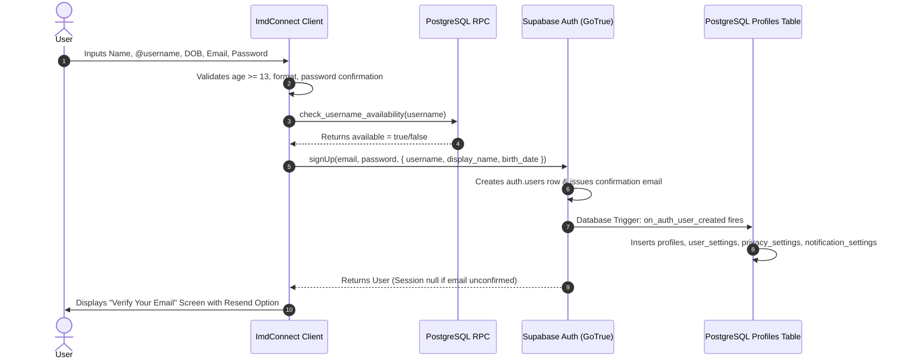
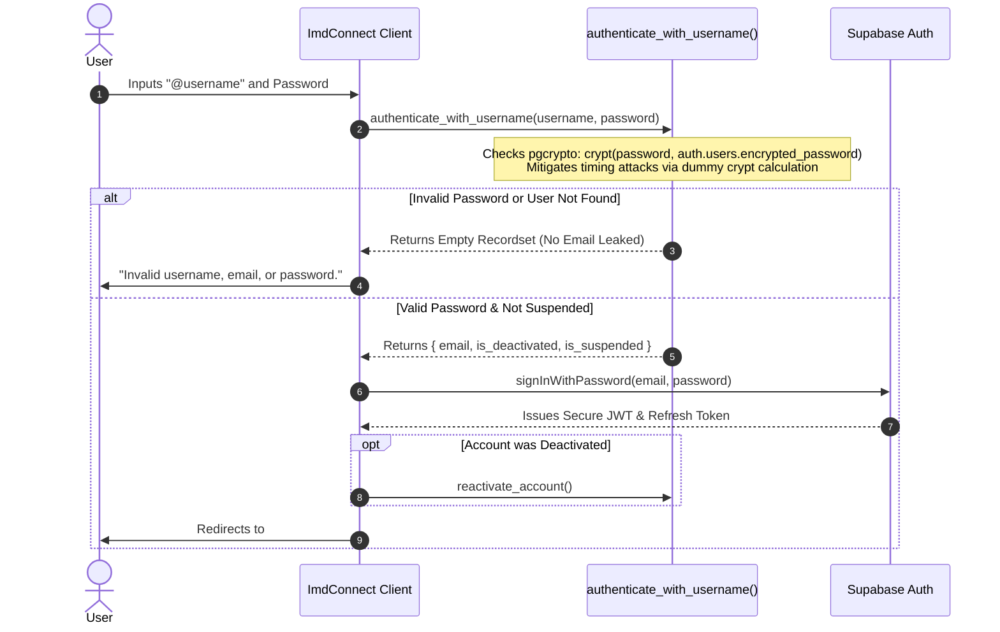

# ImdConnect — Authentication System Architecture & Security Specification

**System:** ImdConnect  
**Authentication Engine:** Supabase Auth (GoTrue) + PostgreSQL 15+  
**Frontend Architecture:** Vanilla JavaScript (ES Modules), HTML5, CSS3  
**Migration:** [`supabase/migrations/20261007210000_supabase_authentication_system.sql`](file:///c:/xampp/htdocs/ImdConnect/supabase/migrations/20261007210000_supabase_authentication_system.sql)  
**Service Implementation:** [`src/services/auth.service.js`](file:///c:/xampp/htdocs/ImdConnect/src/services/auth.service.js)  
**Governance Standard:** [AGENTS.md](file:///c:/xampp/htdocs/ImdConnect/AGENTS.md) Rules 8, 10, 11, 12, 13, 14, 15, 16, and 19  

---

## 1. Executive Summary

ImdConnect implements an enterprise-grade, privacy-first authentication system combining **Supabase Auth** for industry-standard credential and session management with custom **PostgreSQL zero-knowledge username resolution**.

The system satisfies all user privacy and security mandates:
- **Zero Mobile Number Demands:** No phone numbers are collected or verified.
- **Private Email Protection:** Emails are used exclusively for verification and recovery; emails are never displayed in profiles or accessible to peers.
- **Zero Plaintext Password Exposure:** Passwords are never stored in custom tables.
- **Zero Account Existence Disclosure:** Login and recovery endpoints return constant generic responses to defeat username/email enumeration.
- **Zero Timing Attacks:** Username authentication lookups execute dummy cryptographic calculations for non-existent users.

---

## 2. Authentication Data Flow Architecture

### 2.1 Registration Sequence

---

### 2.2 Secure Username Login Flow (Timing-Safe)

---

## 3. Core Feature Specifications

### 3.1 Complete Registration Flow Specification
- **Full Name (`name`):** 2 to 100 characters. Validated client-side and sanitized in database bootstrap trigger.
- **Unique Handle (`username`):** 3 to 30 characters matching regex `^[a-z0-9_]{3,30}$`.
  - **Client-Side:** Real-time debounced RPC pre-flight availability check (`check_username_availability`) with live visual cues (checking, available, taken, invalid format).
  - **Server-Side:** PostgreSQL `chk_profiles_username_format` constraint and `UNIQUE` constraint (`profiles_username_key`) on `public.profiles`. The `handle_new_user()` trigger performs duplicate checking and aborts registration with clear exception messaging.
- **Date of Birth (`birthDate`):** 
  - **Client-Side:** Dynamic age calculation (`authService.calculateAge`) with real-time feedback pill showing derived age and compliance. Enforces minimum age of 13 years (`CONFIG.MIN_AGE_YEARS`). Date picker constrained by `max="YYYY-MM-DD"` (today) to prevent future dates.
  - **Server-Side:** PostgreSQL `chk_profiles_min_age` constraint (`birth_date IS NOT NULL AND birth_date <= (CURRENT_DATE - INTERVAL '13 years')`) and trigger validation.
  - **Non-Authoritative Age Rule:** Age is strictly derived on-the-fly (`get_user_age()` RPC or client calculation) from `birth_date`. No static, desynchronizable age column is stored.
  - **Privacy Boundary:** `birth_date` is strictly hidden from peer users in `public_profiles` view (`CASE WHEN p.id = auth.uid() OR is_app_admin() THEN p.birth_date ELSE NULL END`).
- **Private Email (`email`):** Strictly validated format. Managed securely by Supabase Auth; never exposed in public directory lookups or chat interactions.
- **Password & Confirmation:** Minimum 8 characters. Live password criteria checklist and real-time confirmation equality indicator. Hashing and credentials management strictly delegated to Supabase Auth (bcrypt); zero passwords in custom tables.
- **Anti-Hammering Protection:**
  - Client-side rate-limiting cooldown (`CONFIG.REGISTRATION_COOLDOWN_SECONDS = 5`) rejects rapid submission bursts.
  - Submit button disables immediately with spinner on submission.
  - HTTP 429 and rate-limiting responses trigger automated countdown lockouts on the submission button.
- **Safe Profile & Settings Creation:**
  - `handle_new_user()` trigger safely boots `profiles` via `ON CONFLICT (id) DO UPDATE` and defaults for `user_settings`, `privacy_settings`, and `notification_settings` via `ON CONFLICT (user_id) DO NOTHING`.

### 3.2 Login Capabilities
- **Flexible Identifier:** Accepts either `@username` or personal `email`.
- **Remember Session:** Persisted securely via `localStorage` with PKCE flow and automatic token rotation.
- **Email Verification State:** Detects unconfirmed emails and gracefully routes to `#/auth/verify-email`.
- **Deactivation Reactivation:** If an account was previously deactivated, logging in automatically reactivates the profile.

### 3.3 Session & Account Controls
- **Logout (Local):** `supabase.auth.signOut({ scope: 'local' })` terminates the current browser session.
- **Logout (Global):** `supabase.auth.signOut({ scope: 'global' })` invalidates all active sessions across all devices.
- **Password Reset (Forgot Password):** Generates time-limited recovery link sent to private email. Rate-limited to 1 request per 60 seconds with anti-enumeration messaging.
- **Change Password:** In-app authenticated password update via `supabase.auth.updateUser()`.
- **Account Deactivation:** Soft deactivation hides profile from public view while preserving chat history.
- **Account Deletion:** GDPR-compliant hard deletion via `public.delete_account()` which cascades from `auth.users` to scrub all associated messages, sessions, and settings.

---

## 4. Security Implementation Review

| Security Mandate | Implementation Mechanism |
|:---|:---|
| **Zero Plaintext Passwords** | Handled exclusively by Supabase Auth using bcrypt salts. |
| **No Email Harvesting** | `authenticate_with_username` requires matching password hash before returning the internal email address. Unknown users trigger dummy crypt calls to eliminate timing side-channels. |
| **Anti-Enumeration Responses** | Both login failures and password reset requests return identical generic messages regardless of account existence. |
| **Route Protection** | `Router` enforces `requiresAuth` and `requiresGuest` guards before mounting views. |
| **Age & DOB Privacy** | `birth_date` masked from peers via `public_profiles` view; derived age calculated dynamically with zero authoritative static age storage. |
| **Database-Side Constraints** | `chk_profiles_min_age` and `chk_profiles_username_format` ensure data integrity even if client validation is bypassed. |
| **Anti-Hammering UX** | Cooldown timers on registration, resend email, and reset password buttons prevent accidental API spam. |
