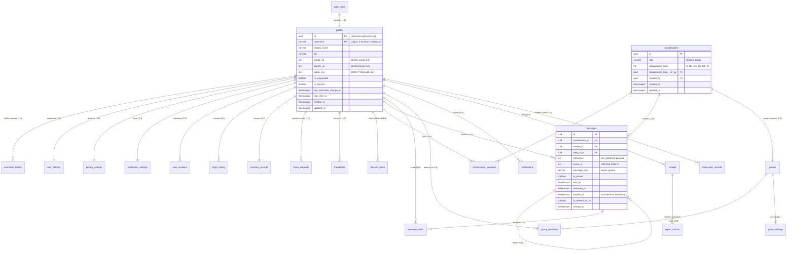

# ImdConnect — PostgreSQL Database Schema Specification

**System:** ImdConnect  
**Target Engine:** PostgreSQL 15+ (Supabase BaaS)  
**Migration File:** [`20261007180000_complete_imdconnect_schema.sql`](file:///c:/xampp/htdocs/ImdConnect/supabase/migrations/20261007180000_complete_imdconnect_schema.sql)  
**Permanent Rules Reference:** [AGENTS.md](file:///c:/xampp/htdocs/ImdConnect/AGENTS.md)  
**Architecture Document:** [ARCHITECTURE_PLAN.md](file:///c:/xampp/htdocs/ImdConnect/docs/ARCHITECTURE_PLAN.md)  

---

## 1. Architectural & Security Principles

1. **Authentication Ownership:** Supabase Auth (`auth.users`) owns user identities, hashed passwords, and session JWTs. No plaintext passwords or external emails are stored in public tables.
2. **Deterministic Synthetic Alias:** Authentication uses `<username>@auth.imdconnect.local` so users never supply personal emails or phone numbers.
3. **Strict Text-Only Messaging:** In accordance with [AGENTS.md](file:///c:/xampp/htdocs/ImdConnect/AGENTS.md) Rules 1 and 2, chat is text-only. The `messages` table contains **zero** attachment, file, media, audio, or document columns.
4. **Isolated Identity Media:** Avatars and cover images are restricted to profile and group identity media, managed in isolated Supabase Storage buckets (`avatars`, `group_covers`).
5. **Universal Row Level Security (RLS):** Every single user-accessible table has RLS enabled with explicit `RESTRICTIVE` default behavior and granular policies.
6. **UTC Timestamps:** All dates and times are stored in UTC using standard PostgreSQL `TIMESTAMPTZ`.

---

## 2. Complete Entity Relationship (ER) Diagram

---

## 3. Entity Catalog & Data Dictionary

### 3.1 User Identity & Security Domain

#### Table: `public.profiles`
Primary identity profile linked 1:1 with Supabase Auth (`auth.users`).
| Column | Type | Constraints | Description |
|:---|:---|:---|:---|
| `id` | `UUID` | `PK`, `REFERENCES auth.users(id) ON DELETE CASCADE` | Internal user ID. |
| `username` | `VARCHAR(30)` | `NOT NULL`, `UNIQUE`, `CHECK (~ '^[a-z0-9_]{3,30}$')` | Unique public handle. |
| `display_name` | `VARCHAR(50)` | Nullable | User visible nickname. |
| `bio` | `VARCHAR(200)` | Nullable | Short user profile blurb. |
| `avatar_url` | `TEXT` | Nullable | Identity profile picture link. |
| `banner_url` | `TEXT` | Nullable | Identity cover/banner image link. |
| `public_key` | `TEXT` | `NOT NULL` | Web Crypto ECDH (P-256) public key for E2EE. |
| `is_suspended` | `BOOLEAN` | `NOT NULL DEFAULT FALSE` | Suspension flag. |
| `suspension_reason` | `TEXT` | Nullable | Reason for account suspension. |
| `suspended_until` | `TIMESTAMPTZ` | Nullable | Scheduled expiration of suspension. |
| `is_banned` | `BOOLEAN` | `NOT NULL DEFAULT FALSE` | Permanent ban flag. |
| `banned_at` | `TIMESTAMPTZ` | Nullable | Timestamp when permanent ban occurred. |
| `last_username_change_at` | `TIMESTAMPTZ` | Nullable | Last time username was changed (for 30-day cooldown). |
| `last_seen_at` | `TIMESTAMPTZ` | `DEFAULT NOW()` | Last active timestamp. |
| `created_at` | `TIMESTAMPTZ` | `NOT NULL DEFAULT NOW()` | UTC record creation. |
| `updated_at` | `TIMESTAMPTZ` | `NOT NULL DEFAULT NOW()` | UTC record update. |

#### Table: `public.username_history`
Audit ledger tracking past username modifications.
| Column | Type | Constraints | Description |
|:---|:---|:---|:---|
| `id` | `UUID` | `PK DEFAULT gen_random_uuid()` | Audit record ID. |
| `user_id` | `UUID` | `FK profiles(id) ON DELETE CASCADE` | Associated user. |
| `old_username` | `VARCHAR(30)` | `NOT NULL` | Previous handle. |
| `new_username` | `VARCHAR(30)` | `NOT NULL` | New handle. |
| `changed_at` | `TIMESTAMPTZ` | `NOT NULL DEFAULT NOW()` | Timestamp of modification. |

#### Table: `public.recovery_records`
Zero-knowledge cryptographic key backup records.
| Column | Type | Constraints | Description |
|:---|:---|:---|:---|
| `user_id` | `UUID` | `PK REFERENCES profiles(id) ON DELETE CASCADE` | User ID. |
| `recovery_hash` | `TEXT` | `NOT NULL` | Hash of client recovery mnemonic seed. |
| `encrypted_key_vault` | `TEXT` | `NOT NULL` | AES-256-GCM ciphertext of private keys. |
| `vault_nonce_iv` | `TEXT` | `NOT NULL` | Initialization vector for key vault. |
| `updated_at` | `TIMESTAMPTZ` | `NOT NULL DEFAULT NOW()` | Last vault update. |

---

### 3.2 User Preferences & System Configuration

#### Table: `public.user_settings`
| Column | Type | Constraints | Description |
|:---|:---|:---|:---|
| `user_id` | `UUID` | `PK REFERENCES profiles(id) ON DELETE CASCADE` | User ID. |
| `theme` | `VARCHAR(10)` | `NOT NULL DEFAULT 'system' CHECK ('light', 'dark', 'system')` | Theme preference. |
| `language` | `VARCHAR(10)` | `NOT NULL DEFAULT 'en'` | UI locale code. |
| `sound_effects_enabled` | `BOOLEAN` | `NOT NULL DEFAULT TRUE` | Audio chimes on messages/alerts. |
| `enter_is_send` | `BOOLEAN` | `NOT NULL DEFAULT TRUE` | Enter key keyboard behavior. |
| `created_at` | `TIMESTAMPTZ` | `NOT NULL DEFAULT NOW()` | Record creation. |
| `updated_at` | `TIMESTAMPTZ` | `NOT NULL DEFAULT NOW()` | Record update. |

#### Table: `public.privacy_settings`
| Column | Type | Constraints | Description |
|:---|:---|:---|:---|
| `user_id` | `UUID` | `PK REFERENCES profiles(id) ON DELETE CASCADE` | User ID. |
| `who_can_message_me` | `VARCHAR(15)` | `DEFAULT 'everyone' CHECK ('everyone', 'friends_only', 'nobody')` | Inbound DM filter. |
| `who_can_add_to_groups` | `VARCHAR(15)` | `DEFAULT 'everyone' CHECK ('everyone', 'friends_only', 'nobody')` | Group invitation filter. |
| `read_receipts_enabled` | `BOOLEAN` | `NOT NULL DEFAULT TRUE` | Read ticks broadcast toggle. |
| `online_status_visible` | `BOOLEAN` | `NOT NULL DEFAULT TRUE` | Online presence broadcast toggle. |
| `last_seen_visible` | `BOOLEAN` | `NOT NULL DEFAULT TRUE` | Last seen timestamp visibility. |
| `default_disappearing_timer`| `INTEGER` | `DEFAULT 0 CHECK (0, 30, 300, 3600, 86400, 604800)` | Default disappearing timer (seconds). |
| `created_at` | `TIMESTAMPTZ` | `NOT NULL DEFAULT NOW()` | Record creation. |
| `updated_at` | `TIMESTAMPTZ` | `NOT NULL DEFAULT NOW()` | Record update. |

#### Table: `public.notification_settings`
| Column | Type | Constraints | Description |
|:---|:---|:---|:---|
| `user_id` | `UUID` | `PK REFERENCES profiles(id) ON DELETE CASCADE` | User ID. |
| `push_enabled` | `BOOLEAN` | `NOT NULL DEFAULT TRUE` | Web Push toggle. |
| `direct_messages_notify` | `BOOLEAN` | `NOT NULL DEFAULT TRUE` | DM alert toggle. |
| `group_messages_notify` | `BOOLEAN` | `NOT NULL DEFAULT TRUE` | Group alert toggle. |
| `friend_requests_notify` | `BOOLEAN` | `NOT NULL DEFAULT TRUE` | Contact request alert toggle. |
| `in_app_sounds` | `BOOLEAN` | `NOT NULL DEFAULT TRUE` | In-app notification sound. |
| `preview_message_text` | `BOOLEAN` | `NOT NULL DEFAULT FALSE` | Content preview on lock screen. |
| `created_at` | `TIMESTAMPTZ` | `NOT NULL DEFAULT NOW()` | Record creation. |
| `updated_at` | `TIMESTAMPTZ` | `NOT NULL DEFAULT NOW()` | Record update. |

---

### 3.3 Sessions & Audit Logs

#### Table: `public.user_sessions`
| Column | Type | Constraints | Description |
|:---|:---|:---|:---|
| `id` | `UUID` | `PK DEFAULT gen_random_uuid()` | Session record ID. |
| `user_id` | `UUID` | `FK profiles(id) ON DELETE CASCADE` | User ID. |
| `session_token_hash` | `TEXT` | `NOT NULL` | Cryptographic hash of session token. |
| `client_device_info` | `TEXT` | Nullable | Browser & OS identifier. |
| `ip_address_hash` | `TEXT` | Nullable | One-way privacy hash of client IP. |
| `is_revoked` | `BOOLEAN` | `NOT NULL DEFAULT FALSE` | Session revocation status. |
| `last_active_at` | `TIMESTAMPTZ` | `NOT NULL DEFAULT NOW()` | Last ping timestamp. |
| `created_at` | `TIMESTAMPTZ` | `NOT NULL DEFAULT NOW()` | Session establishment. |

#### Table: `public.login_history`
| Column | Type | Constraints | Description |
|:---|:---|:---|:---|
| `id` | `UUID` | `PK DEFAULT gen_random_uuid()` | Audit ID. |
| `user_id` | `UUID` | `FK profiles(id) ON DELETE CASCADE` | User ID. |
| `success` | `BOOLEAN` | `NOT NULL` | Authentication success indicator. |
| `ip_address_hash` | `TEXT` | Nullable | One-way privacy hash of client IP. |
| `user_agent` | `TEXT` | Nullable | Browser User-Agent string. |
| `failure_reason` | `TEXT` | Nullable | Failure categorization if unsuccessful. |
| `created_at` | `TIMESTAMPTZ` | `NOT NULL DEFAULT NOW()` | Attempt timestamp. |

---

### 3.4 Social & Contact Relationships

#### Table: `public.friend_requests`
| Column | Type | Constraints | Description |
|:---|:---|:---|:---|
| `id` | `UUID` | `PK DEFAULT gen_random_uuid()` | Request ID. |
| `sender_id` | `UUID` | `FK profiles(id) ON DELETE CASCADE` | User sending the request. |
| `receiver_id` | `UUID` | `FK profiles(id) ON DELETE CASCADE` | Target user. |
| `status` | `VARCHAR(15)` | `DEFAULT 'pending' CHECK ('pending', 'accepted', 'rejected', 'cancelled')` | Request status. |
| `created_at` | `TIMESTAMPTZ` | `NOT NULL DEFAULT NOW()` | Created timestamp. |
| `updated_at` | `TIMESTAMPTZ` | `NOT NULL DEFAULT NOW()` | Status change timestamp. |

#### Table: `public.friendships`
| Column | Type | Constraints | Description |
|:---|:---|:---|:---|
| `id` | `UUID` | `PK DEFAULT gen_random_uuid()` | Friendship record ID. |
| `user_id` | `UUID` | `FK profiles(id) ON DELETE CASCADE` | User ID. |
| `friend_id` | `UUID` | `FK profiles(id) ON DELETE CASCADE` | Friend's User ID. |
| `custom_nickname` | `VARCHAR(50)` | Nullable | Local private alias for the friend. |
| `created_at` | `TIMESTAMPTZ` | `NOT NULL DEFAULT NOW()` | Friendship establishment. |

#### Table: `public.blocked_users`
| Column | Type | Constraints | Description |
|:---|:---|:---|:---|
| `id` | `UUID` | `PK DEFAULT gen_random_uuid()` | Block record ID. |
| `blocker_id` | `UUID` | `FK profiles(id) ON DELETE CASCADE` | User who initiated block. |
| `blocked_id` | `UUID` | `FK profiles(id) ON DELETE CASCADE` | User who is blocked. |
| `reason` | `TEXT` | Nullable | Private reason for block. |
| `created_at` | `TIMESTAMPTZ` | `NOT NULL DEFAULT NOW()` | Timestamp block occurred. |

---

### 3.5 Messaging Domain (Strictly Text-Only)

#### Table: `public.conversations`
| Column | Type | Constraints | Description |
|:---|:---|:---|:---|
| `id` | `UUID` | `PK DEFAULT gen_random_uuid()` | Conversation ID. |
| `type` | `VARCHAR(10)` | `NOT NULL CHECK ('direct', 'group')` | Conversation topology. |
| `disappearing_timer` | `INTEGER` | `NOT NULL DEFAULT 0 CHECK (0, 30, 300, 3600, 86400, 604800)` | Ephemeral timer in seconds. |
| `disappearing_timer_set_by` | `UUID` | `FK profiles(id) ON DELETE SET NULL` | User who updated the timer. |
| `disappearing_timer_updated_at`| `TIMESTAMPTZ` | Nullable | Timestamp of timer adjustment. |
| `created_by` | `UUID` | `FK profiles(id) ON DELETE SET NULL` | Initial conversation creator. |
| `created_at` | `TIMESTAMPTZ` | `NOT NULL DEFAULT NOW()` | Creation timestamp. |
| `updated_at` | `TIMESTAMPTZ` | `NOT NULL DEFAULT NOW()` | Last message or update timestamp. |

#### Table: `public.conversation_members`
| Column | Type | Constraints | Description |
|:---|:---|:---|:---|
| `id` | `UUID` | `PK DEFAULT gen_random_uuid()` | Membership ID. |
| `conversation_id` | `UUID` | `FK conversations(id) ON DELETE CASCADE` | Target conversation. |
| `user_id` | `UUID` | `FK profiles(id) ON DELETE CASCADE` | Participant. |
| `role` | `VARCHAR(10)` | `DEFAULT 'member' CHECK ('owner', 'admin', 'member')` | Member role. |
| `encrypted_conversation_key` | `TEXT` | Nullable | E2EE conversation key wrapped with user's ECDH public key. |
| `is_muted` | `BOOLEAN` | `NOT NULL DEFAULT FALSE` | Conversation notification mute flag. |
| `is_pinned` | `BOOLEAN` | `NOT NULL DEFAULT FALSE` | Conversation pinned in list flag. |
| `is_archived` | `BOOLEAN` | `NOT NULL DEFAULT FALSE` | Conversation archived flag. |
| `joined_at` | `TIMESTAMPTZ` | `NOT NULL DEFAULT NOW()` | Join timestamp. |
| `last_read_at` | `TIMESTAMPTZ` | Nullable | Timestamp of last read message. |

#### Table: `public.messages` (Strictly Text-Only)
| Column | Type | Constraints | Description |
|:---|:---|:---|:---|
| `id` | `UUID` | `PK DEFAULT gen_random_uuid()` | Message ID. |
| `conversation_id` | `UUID` | `FK conversations(id) ON DELETE CASCADE` | Conversation thread. |
| `sender_id` | `UUID` | `FK profiles(id) ON DELETE CASCADE` | Author of message. |
| `reply_to_id` | `UUID` | `FK messages(id) ON DELETE SET NULL` | Quoted message ID (text thread reply). |
| `ciphertext` | `TEXT` | `NOT NULL` | Encrypted text payload. |
| `nonce_iv` | `TEXT` | `NOT NULL` | AES-256-GCM 96-bit initialization vector. |
| `message_type` | `VARCHAR(10)` | `DEFAULT 'text' CHECK ('text', 'system')` | Message category (no media types). |
| `is_pinned` | `BOOLEAN` | `NOT NULL DEFAULT FALSE` | Pinned status in conversation. |
| `sent_at` | `TIMESTAMPTZ` | `NOT NULL DEFAULT NOW()` | Timestamp message was sent. |
| `delivered_at` | `TIMESTAMPTZ` | Nullable | Timestamp confirmed delivered. |
| `expires_at` | `TIMESTAMPTZ` | Nullable | Automated self-destruct timestamp. |
| `is_deleted_for_all` | `BOOLEAN` | `NOT NULL DEFAULT FALSE` | Sender soft-delete indicator. |
| `deleted_at` | `TIMESTAMPTZ` | Nullable | Timestamp soft-deleted. |
| `created_at` | `TIMESTAMPTZ` | `NOT NULL DEFAULT NOW()` | Database insertion timestamp. |
| `updated_at` | `TIMESTAMPTZ` | `NOT NULL DEFAULT NOW()` | Update timestamp. |

#### Table: `public.message_reads`
| Column | Type | Constraints | Description |
|:---|:---|:---|:---|
| `id` | `UUID` | `PK DEFAULT gen_random_uuid()` | Read receipt record ID. |
| `message_id` | `UUID` | `FK messages(id) ON DELETE CASCADE` | Associated message. |
| `user_id` | `UUID` | `FK profiles(id) ON DELETE CASCADE` | Reader of message. |
| `read_at` | `TIMESTAMPTZ` | `NOT NULL DEFAULT NOW()` | Timestamp message was read. |

---

### 3.6 Groups Domain

#### Table: `public.groups`
| Column | Type | Constraints | Description |
|:---|:---|:---|:---|
| `conversation_id` | `UUID` | `PK FK conversations(id) ON DELETE CASCADE` | 1:1 conversation link. |
| `name` | `VARCHAR(100)` | `NOT NULL` | Group name. |
| `description` | `VARCHAR(300)` | Nullable | Group topic/description. |
| `avatar_url` | `TEXT` | Nullable | Group identity avatar picture. |
| `cover_url` | `TEXT` | Nullable | Group identity banner/cover image. |
| `owner_id` | `UUID` | `FK profiles(id) ON DELETE RESTRICT` | Group owner profile. |
| `is_public` | `BOOLEAN` | `NOT NULL DEFAULT FALSE` | Discovery visibility. |
| `invite_code` | `VARCHAR(32)` | `UNIQUE` | Unique group invitation link code. |
| `created_at` | `TIMESTAMPTZ` | `NOT NULL DEFAULT NOW()` | Group creation timestamp. |
| `updated_at` | `TIMESTAMPTZ` | `NOT NULL DEFAULT NOW()` | Group profile update timestamp. |

#### Table: `public.group_members`
| Column | Type | Constraints | Description |
|:---|:---|:---|:---|
| `id` | `UUID` | `PK DEFAULT gen_random_uuid()` | Group member record ID. |
| `group_id` | `UUID` | `FK groups(conversation_id) ON DELETE CASCADE` | Associated group. |
| `user_id` | `UUID` | `FK profiles(id) ON DELETE CASCADE` | Member profile. |
| `role` | `VARCHAR(10)` | `DEFAULT 'member' CHECK ('owner', 'admin', 'member')` | Member role. |
| `can_invite` | `BOOLEAN` | `NOT NULL DEFAULT TRUE` | Permission to invite peers. |
| `can_pin_messages` | `BOOLEAN` | `NOT NULL DEFAULT FALSE` | Permission to pin text messages. |
| `can_change_info` | `BOOLEAN` | `NOT NULL DEFAULT FALSE` | Permission to modify group profile. |
| `joined_at` | `TIMESTAMPTZ` | `NOT NULL DEFAULT NOW()` | Member join timestamp. |

#### Table: `public.group_settings`
| Column | Type | Constraints | Description |
|:---|:---|:---|:---|
| `group_id` | `UUID` | `PK FK groups(conversation_id) ON DELETE CASCADE` | Associated group. |
| `who_can_send_messages` | `VARCHAR(15)` | `DEFAULT 'everyone' CHECK ('everyone', 'admins_only')` | Posting permission. |
| `who_can_edit_group_info`| `VARCHAR(15)` | `DEFAULT 'admins_only' CHECK ('everyone', 'admins_only')` | Metadata edit permission. |
| `who_can_invite_members` | `VARCHAR(15)` | `DEFAULT 'everyone' CHECK ('everyone', 'admins_only')` | Invite permission. |
| `disappearing_messages_enabled`| `BOOLEAN`| `NOT NULL DEFAULT FALSE` | Group ephemeral toggle. |
| `disappearing_timer` | `INTEGER` | `DEFAULT 0 CHECK (0, 30, 300, 3600, 86400, 604800)` | Ephemeral lifespan. |
| `allow_member_list_visibility`| `BOOLEAN`| `NOT NULL DEFAULT TRUE` | Member directory visibility. |
| `created_at` | `TIMESTAMPTZ` | `NOT NULL DEFAULT NOW()` | Record creation. |
| `updated_at` | `TIMESTAMPTZ` | `NOT NULL DEFAULT NOW()` | Record update. |

---

### 3.7 Notifications & Moderation Domain

#### Table: `public.notifications`
| Column | Type | Constraints | Description |
|:---|:---|:---|:---|
| `id` | `UUID` | `PK DEFAULT gen_random_uuid()` | Notification ID. |
| `user_id` | `UUID` | `FK profiles(id) ON DELETE CASCADE` | Recipient. |
| `type` | `VARCHAR(30)` | `CHECK ('friend_request', 'friend_accepted', 'group_invite', 'group_mention', 'system_alert', 'moderation_notice')` | Event type. |
| `title` | `VARCHAR(100)` | `NOT NULL` | Notification header. |
| `body` | `TEXT` | `NOT NULL` | Notification message text. |
| `data` | `JSONB` | `DEFAULT '{}'` | Metadata (context ID, sender username). |
| `is_read` | `BOOLEAN` | `NOT NULL DEFAULT FALSE` | Read status. |
| `read_at` | `TIMESTAMPTZ` | Nullable | Read timestamp. |
| `created_at` | `TIMESTAMPTZ` | `NOT NULL DEFAULT NOW()` | Dispatch timestamp. |

#### Table: `public.reports`
| Column | Type | Constraints | Description |
|:---|:---|:---|:---|
| `id` | `UUID` | `PK DEFAULT gen_random_uuid()` | Report ID. |
| `reporter_id` | `UUID` | `FK profiles(id) ON DELETE CASCADE` | Submitting user. |
| `reported_user_id` | `UUID` | `FK profiles(id) ON DELETE CASCADE` | Accused user. |
| `reported_conversation_id`| `UUID` | `FK conversations(id) ON DELETE SET NULL` | Conversation context. |
| `reported_message_id` | `UUID` | `FK messages(id) ON DELETE SET NULL` | Specific text message reported. |
| `category` | `VARCHAR(30)` | `CHECK ('harassment', 'spam', 'impersonation', 'inappropriate_behavior', 'other')` | Report classification. |
| `reason` | `TEXT` | `NOT NULL` | User explanation. |
| `status` | `VARCHAR(15)` | `DEFAULT 'pending' CHECK ('pending', 'investigating', 'resolved', 'dismissed')` | Workflow state. |
| `resolution_notes` | `TEXT` | Nullable | Moderator notes. |
| `resolved_by` | `UUID` | `FK profiles(id) ON DELETE SET NULL` | Moderator ID. |
| `resolved_at` | `TIMESTAMPTZ` | Nullable | Resolution timestamp. |
| `created_at` | `TIMESTAMPTZ` | `NOT NULL DEFAULT NOW()` | Report submission timestamp. |
| `updated_at` | `TIMESTAMPTZ` | `NOT NULL DEFAULT NOW()` | Record update timestamp. |

#### Table: `public.report_actions`
| Column | Type | Constraints | Description |
|:---|:---|:---|:---|
| `id` | `UUID` | `PK DEFAULT gen_random_uuid()` | Action log ID. |
| `report_id` | `UUID` | `FK reports(id) ON DELETE CASCADE` | Associated report. |
| `moderator_id` | `UUID` | `FK profiles(id) ON DELETE RESTRICT` | Moderator who took action. |
| `action_type` | `VARCHAR(30)` | `CHECK ('warning_issued', 'content_removed', 'user_suspended', 'user_banned', 'report_dismissed')` | Action taken. |
| `notes` | `TEXT` | Nullable | Internal justification. |
| `created_at` | `TIMESTAMPTZ` | `NOT NULL DEFAULT NOW()` | Action execution timestamp. |

#### Table: `public.moderation_records`
| Column | Type | Constraints | Description |
|:---|:---|:---|:---|
| `id` | `UUID` | `PK DEFAULT gen_random_uuid()` | Audit record ID. |
| `user_id` | `UUID` | `FK profiles(id) ON DELETE CASCADE` | Moderated user. |
| `moderator_id` | `UUID` | `FK profiles(id) ON DELETE SET NULL` | Acting moderator. |
| `action` | `VARCHAR(25)` | `CHECK ('warning', 'temporary_suspension', 'permanent_ban', 'unban', 'unsuspend')` | Moderation action. |
| `reason` | `TEXT` | `NOT NULL` | Formal reason provided. |
| `expires_at` | `TIMESTAMPTZ` | Nullable | Expiration for temporary suspensions. |
| `created_at` | `TIMESTAMPTZ` | `NOT NULL DEFAULT NOW()` | Log timestamp. |

---

## 4. Key Business Logic & Triggers

1. **Auto-Profile Bootstrap (`on_auth_user_created`):**  
   Whenever a user completes registration via Supabase Auth, a PostgreSQL trigger immediately creates:
   - A row in `profiles` with their sanitized `@username` and public key.
   - Default preferences in `user_settings`.
   - Default privacy configurations in `privacy_settings`.
   - Default notification preferences in `notification_settings`.
2. **30-Day Username Cooldown (`trg_enforce_username_cooldown`):**  
   When a user updates `profiles.username`, the trigger verifies whether `last_username_change_at` is older than 30 days. If violated, an exception is raised database-side; if permitted, it logs the change to `username_history` and updates `last_username_change_at`.
3. **Disappearing Message Calculation (`trg_set_message_expiration`):**  
   Upon message creation, if `expires_at` is null, the trigger checks the parent `conversations.disappearing_timer`. If set (e.g. 300s), `expires_at` is set to `sent_at + INTERVAL '300 seconds'`.
4. **Automated Ephemeral Shredding (`pg_cron`):**  
   Every 60 seconds (`* * * * *`), `pg_cron` hard-deletes all messages where `expires_at <= NOW()`. Even before the cron sweeps, RLS policies prevent expired messages from being selected.

---

## 5. Row-Level Security (RLS) Policy Reference

| Table | Operation | Authorization Rule / Filter |
|:---|:---|:---|
| `profiles` | `SELECT` | All authenticated users can view non-banned profiles. |
| `profiles` | `UPDATE` | `auth.uid() = id AND NOT is_suspended AND NOT is_banned`. |
| `username_history` | `SELECT` | `auth.uid() = user_id`. |
| `user_settings` | `ALL` | `auth.uid() = user_id`. |
| `privacy_settings` | `ALL` | `auth.uid() = user_id`. |
| `notification_settings` | `ALL` | `auth.uid() = user_id`. |
| `user_sessions` | `ALL` | `auth.uid() = user_id`. |
| `login_history` | `SELECT` | `auth.uid() = user_id`. |
| `recovery_records` | `ALL` | `auth.uid() = user_id`. |
| `friend_requests` | `SELECT` | `auth.uid() IN (sender_id, receiver_id)`. |
| `friend_requests` | `INSERT` | `auth.uid() = sender_id AND NOT is_blocked_by(receiver_id)`. |
| `friend_requests` | `UPDATE` | `auth.uid() IN (sender_id, receiver_id)`. |
| `friendships` | `ALL` | `auth.uid() = user_id`. |
| `blocked_users` | `ALL` | `auth.uid() = blocker_id`. |
| `conversations` | `SELECT` | `is_conv_member(id) = true`. |
| `conversations` | `INSERT` | `auth.uid() = created_by`. |
| `conversations` | `UPDATE` | `is_conv_member(id) = true`. |
| `conversation_members` | `SELECT` | `is_conv_member(conversation_id) = true`. |
| `conversation_members` | `INSERT/DELETE`| Self-action OR conversation owner/admin. |
| `groups` | `SELECT` | `is_public OR is_conv_member(conversation_id)`. |
| `groups` | `UPDATE` | Group admin or owner. |
| `group_members` | `ALL` | Group admin or owner or self. |
| `group_settings` | `SELECT` | Member of group. |
| `group_settings` | `UPDATE` | Group admin or owner. |
| `messages` | `SELECT` | `is_conv_member(conversation_id) AND (expires_at IS NULL OR expires_at > NOW()) AND NOT is_deleted_for_all`. |
| `messages` | `INSERT` | Member of conversation, not suspended/banned, not blocked by direct recipient. |
| `messages` | `UPDATE` | Author only (soft delete / pin). |
| `message_reads` | `SELECT` | Member of conversation containing the message. |
| `message_reads` | `INSERT` | `auth.uid() = user_id`. |
| `notifications` | `ALL` | `auth.uid() = user_id`. |
| `reports` | `INSERT/SELECT`| Reporter (`auth.uid() = reporter_id`). |
| `moderation_records`| `SELECT` | Moderated user (`auth.uid() = user_id`). |
